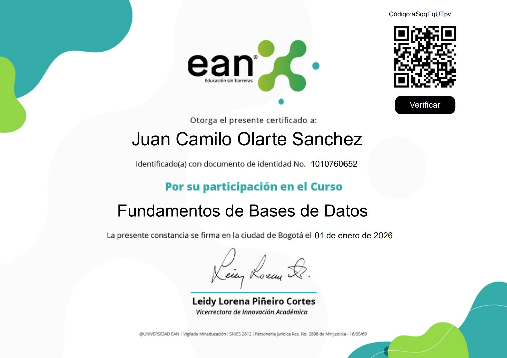
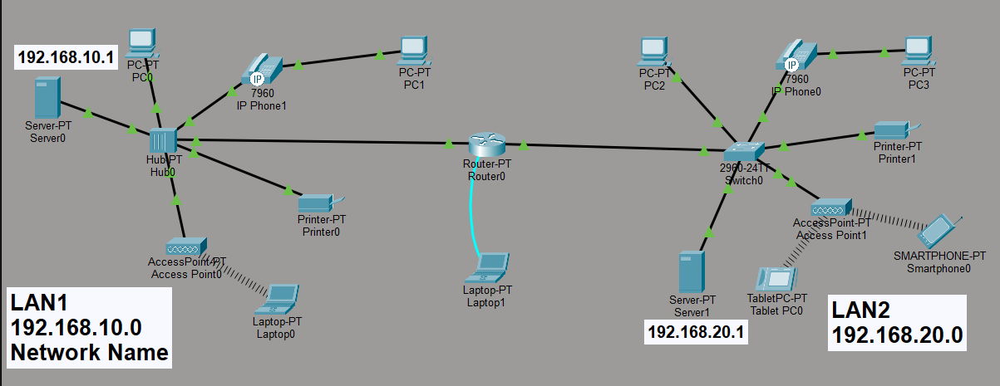
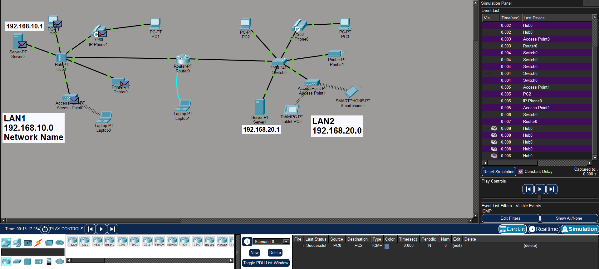
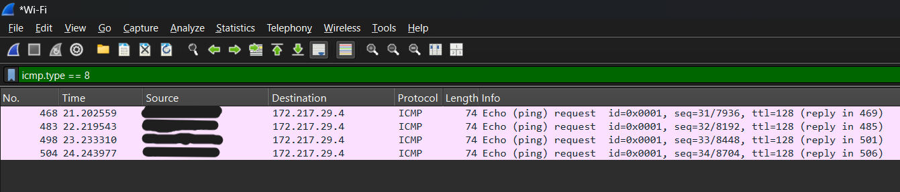

I'm Juan Olarte, a System engineer student in last year, curious and passionate about cibersecurity. 
What you're about to see now is my path toward becoming a skilled cybersecurity professional.
  
--- 
# Certifications
--- 
## Google Cybersecurity Analyst.


[Google Certificate](https://coursera.org/share/b80037a5a918023d1fae9f27a3f3aa50).

The Google Cibersecurity Analyst course was mi first view to the cibersecurity world and it create good bases for my knowledge.

--- 

## Data Bases Basics

[DB Certificate](https://eanx.co/certificate/aSggEqUTpv).

A good explanation of conseptual foundations from DB.

--- 
# Technical Skills & Projects
---
## Cisco Packet Tracer 
<div style="display: flex; gap: 10px;">
  
  
</div>

In the university we made this network to understand the layers of communication, some protocols and how the networks work. Also we prove that the network work.

---

## Wireshark


Here is a basic consult before doing a ping to www.google.com (this is just the request) 

---

<section id="about">
  <h2>About Me</h2>
  <p>
    I’m Juan Camilo Olarte, a Systems Engineering student with a strong interest in cybersecurity, programming, 
    and digital technologies. I hold the Google Cybersecurity Professional Certificate (2024) and have experience 
    working with Python, Linux, SIEM tools, SQL, and security frameworks such as NIST. I enjoy solving problems, 
    learning new technologies, and applying my knowledge to real-world projects. My goal is to grow as a 
    cybersecurity professional while building impactful and secure digital solutions.
  </p>
</section>
```
Thanks for being here :)
```
